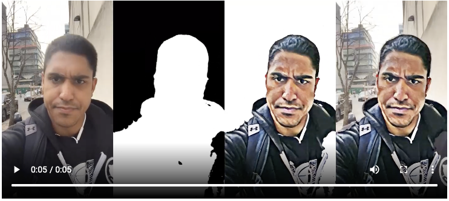
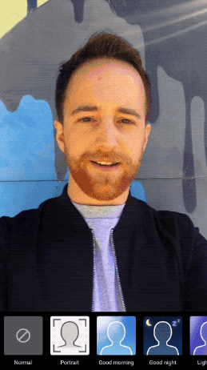
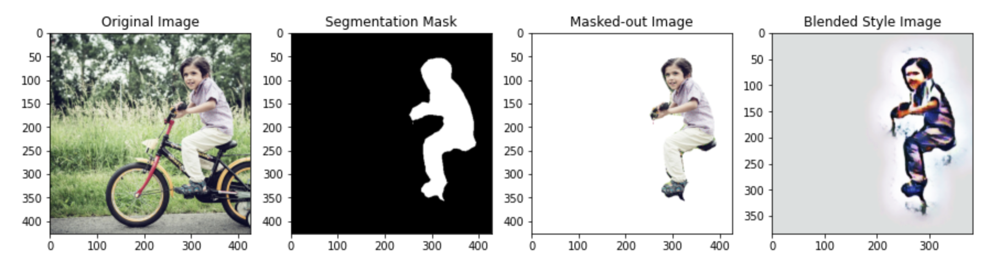
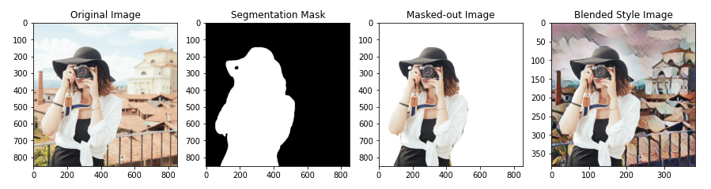

# Background Stylizer - with Segmentation & Style Transfer

This is the GitHub repo for an end-to-end tutorial from TFLite model conversion, to model deployment on an Android and iOS. 
Links to the multi-part tutorial on Medium:

Links to blog posts:
1. [Project Intro](https://medium.com/@margaretmz/image-background-stylizer-part-1-project-intro-d68c4547e7e3), [Margaret Maynard-Reid](https://twitter.com/margaretmz)
2. [TensorFlow Lite models](https://medium.com/@spsayakpaul/e614af91944d), [Sayak Paul](https://twitter.com/RisingSayak)
3. [Android implementation](https://farmaker47.medium.com/android-part-of-create-artistic-effect-by-stylizing-an-image-segment-2a646da2d39a), [George Soloupis](https://www.linkedin.com/in/george-soloupis/)
4. iOS implementation, Patrick Haralabidis (coming soon)

This project combines multiple CV models to create visually appealing demo that run in real time on device. For example, [segmentation plus style transfer]; or segmentation plus background removal ([1](https://ai.googleblog.com/2018/03/mobile-real-time-video-segmentation.html) | [2](https://twitter.com/jason_mayes/status/1229547600895823873))

 
 

For its creativity and real-world relevance, the project got the [#TFCommunitySpotlight award](https://twitter.com/TensorFlow/status/1351590466068783105).

Demo created by [Sayak Paul](https://github.com/sayakpaul) ([Colab Notebook](https://colab.research.google.com/github/sayakpaul/Adventures-in-TensorFlow-Lite/blob/master/Semantic_Segmentation_%2B_Background_Removal_%2B_Style_Transfer.ipynb))

 

Demo created by [Khanh LeViet](https://github.com/khanhlvg) ([Colab Notebook](https://colab.research.google.com/drive/1KZpmuwBfLZM_0mzUyX2W-xcNq26jCNtn))

 

